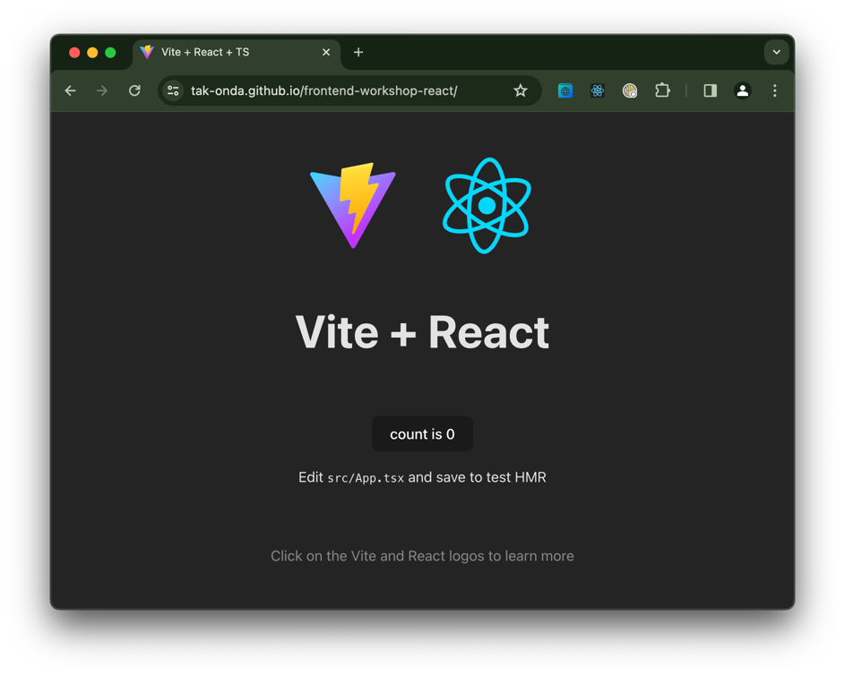

# フロントエンド入門ワークショップ React 編

## 前準備

### 環境

本ワークショップは WSL2 または macOS 環境を前提とします

### Node.js のインストール

直接インストールしてもよいですが、これを機に [mise](https://mise.jdx.dev/getting-started.html) のようなバージョンマネージャーを導入することをお勧めします。

Node.js 最新 LTS の 20.x 系が使えることを確認してください。

```shell
$ node -v
v20.11.1
```

パッケージマネージャーは pnpm を利用します。
(様々なプロジェクトで pnpm を利用しているため)

```shell
$ corepack enable pnpm


## プロジェクトの作成

```shell
$ pnpm create vite frontend-workshop-react --template react-ts
../Library/pnpm/store/v3/tmp/dlx-13453   |   +1 +
../Library/pnpm/store/v3/tmp/dlx-13453   | Progress: resolved 1, reused 1, downloaded 0, added 1, done

Scaffolding project in /Users/ondat/workspace/frontend-workshop-react...

Done. Now run:

  cd frontend-workshop-react
  pnpm install
  pnpm run dev

$ cd frontend-workshop-react

$ pnpm install
Downloading registry.npmjs.org/typescript/5.4.3: 5.82 MB/5.82 MB, done
Packages: +211
++++++++++++++++++++++++++++++++++++++++++++++++++++++++++++++++++++++++++++++++++++++++++++++++++++++++++++++++++++++++++++++++++++++++++++++++++++++++++++++++++++++++++++++++++
Progress: resolved 245, reused 175, downloaded 36, added 211, done
node_modules/.pnpm/esbuild@0.20.2/node_modules/esbuild: Running postinstall script, done in 231ms

dependencies:
+ react 18.2.0
+ react-dom 18.2.0

devDependencies:
+ @types/react 18.2.69
+ @types/react-dom 18.2.22
+ @typescript-eslint/eslint-plugin 7.3.1
+ @typescript-eslint/parser 7.3.1
+ @vitejs/plugin-react 4.2.1
+ eslint 8.57.0
+ eslint-plugin-react-hooks 4.6.0
+ eslint-plugin-react-refresh 0.4.6
+ typescript 5.4.3
+ vite 5.2.6

Done in 18.6s
```

pnpm を最新にアップデート

```shell
$ corepack use pnpm@latest
Installing pnpm@8.15.5 in the project...

Lockfile is up to date, resolution step is skipped
Already up to date
Done in 574ms
```

dev モードで起動して動作確認を行います。

```shell
$ pnpm dev

  VITE v5.2.6  ready in 113 ms

  ➜  Local:   http://localhost:5173/
  ➜  Network: use --host to expose
  ➜  press h + enter to show help
```  

ブラウザで `http://localhost:5173/` を開いて、以下の画面が表示されれば成功です。


## リポジトリの作成

GitHub Pages を利用したいので、個人アカウントで public repository を作成してください。

```shell
$ git init
$ git add .
$ git commit -m 'initial commit'
[main (root-commit) e55d64b] initial commit
 17 files changed, 2325 insertions(+)
 create mode 100644 .eslintrc.cjs
 create mode 100644 .gitignore
 create mode 100644 README.md
 create mode 100644 img.png
 create mode 100644 index.html
 create mode 100644 package.json
 create mode 100644 pnpm-lock.yaml
 create mode 100644 public/vite.svg
 create mode 100644 src/App.css
 create mode 100644 src/App.tsx
 create mode 100644 src/assets/react.svg
 create mode 100644 src/index.css
 create mode 100644 src/main.tsx
 create mode 100644 src/vite-env.d.ts
 create mode 100644 tsconfig.json
 create mode 100644 tsconfig.node.json
 create mode 100644 vite.config.ts
 
$ git branch -M main

$ git remote add origin https://github.com/tak-onda/frontend-workshop-react.git

$ git push -u origin main
Enumerating objects: 22, done.
Counting objects: 100% (22/22), done.
Delta compression using up to 10 threads
Compressing objects: 100% (19/19), done.
Writing objects: 100% (22/22), 141.16 KiB | 20.17 MiB/s, done.
Total 22 (delta 0), reused 0 (delta 0), pack-reused 0 (from 0)
To https://github.com/tak-onda/frontend-workshop-react.git
 * [new branch]      main -> main
branch 'main' set up to track 'origin/main'.
```


## デプロイ

GitHub Pages にデプロイするために、以下の手順で設定を行います。

### `vite.config.ts` の設定

`base` に作成したリポジトリ名を `/<repository-name>/` として指定してください

```typescript
import { defineConfig } from 'vite'
import react from '@vitejs/plugin-react'

// https://vitejs.dev/config/
export default defineConfig({
    plugins: [react()],
    base: '/frontend-workshop-react/'
})
```

### `package.json` の設定

GitHub Actions で Node.js および pnpm のバージョンを特定できるように `engines` 部分を追記します。

```json
    "typescript": "^5.4.3",
    "vite": "^5.2.6"
  },
  "engines": {
    "node": ">=20.0",
    "pnpm": ">=8.14"
  },
  "packageManager": "pnpm@8.15.5+sha256.4b4..."
```

### GitHub Actions の設定

`.github/workflows/deploy.yaml` を作成します。

以下をそのままコピーしてください。

```yaml
# Simple workflow for deploying static content to GitHub Pages
name: Deploy static content to Pages

on:
  # Runs on pushes targeting the default branch
  push:
    branches: ["main"]

  # Allows you to run this workflow manually from the Actions tab
  workflow_dispatch:

# Sets permissions of the GITHUB_TOKEN to allow deployment to GitHub Pages
permissions:
  contents: read
  pages: write
  id-token: write

# Allow only one concurrent deployment, skipping runs queued between the run in-progress and latest queued.
# However, do NOT cancel in-progress runs as we want to allow these production deployments to complete.
concurrency:
  group: "pages"
  cancel-in-progress: false

jobs:
  # Single deploy job since we're just deploying
  deploy:
    environment:
      name: github-pages
      url: ${{ steps.deployment.outputs.page_url }}
    runs-on: ubuntu-latest
    steps:
      - name: Checkout
        uses: actions/checkout@v4

      - name: Setup Pages
        uses: actions/configure-pages@v4

      - name: Enable corepack
        run: corepack enable

      - uses: actions/setup-node@v4
        with:
          node-version-file: 'package.json'
          cache: 'pnpm'
          cache-dependency-path: 'pnpm-lock.yaml'

      - name: Install dependencies
        run: pnpm install --frozen-lockfile

      - name: build pages
        run: pnpm build

      - name: Upload artifact
        uses: actions/upload-pages-artifact@v3
        with:
          # Upload entire repository
          path: './dist'

      - name: Deploy to GitHub Pages
        id: deployment
        uses: actions/deploy-pages@v4
```

### 追加したファイルを commit して push

```shell
$ git add .
$ git commit -m 'add deploy config'
$ git push
```


## 動作確認

### GitHub Actions の確認

Actions タブから deploy が走っていることを確認してください


### ブラウザで確認

`https://<username>.github.io/<repository-name>/` にアクセスして、以下の画面が表示されれば成功です。



